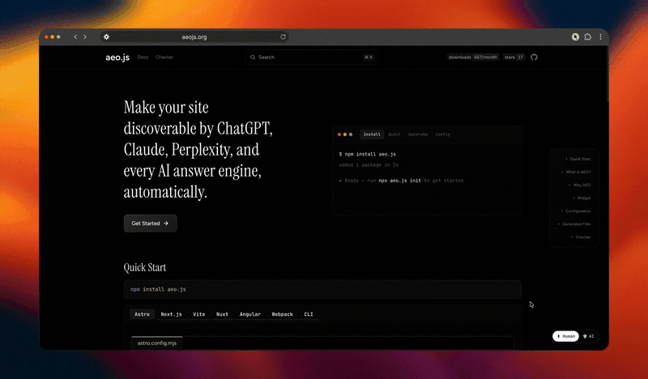

<p align="center">
  <h1 align="center">aeo.js</h1>
  <p align="center">Answer Engine Optimization for the modern web.<br/>Make your site discoverable by ChatGPT, Claude, Perplexity, and every AI answer engine.</p>
</p>

<p align="center">
  <a href="https://www.npmjs.com/package/aeo.js"></a>
  <a href="https://www.npmjs.com/package/aeo.js"></a>
  <a href="https://github.com/multivmlabs/aeo.js"></a>
  <a href="https://github.com/multivmlabs/aeo.js/blob/main/LICENSE"></a>
</p>

<p align="center">
  <a href="https://aeojs.org">Documentation</a> · <a href="https://check.aeojs.org">AEO Checker</a> · <a href="https://www.npmjs.com/package/aeo.js">npm</a>
</p>

<p align="center">
  
</p>

## Install

```bash
npm install aeo.js
```

## Quick Start

### Astro

```js
// astro.config.mjs
import { defineConfig } from 'astro/config';
import { aeoAstroIntegration } from 'aeo.js/astro';

export default defineConfig({
  site: 'https://mysite.com',
  integrations: [
    aeoAstroIntegration({
      title: 'My Site',
      description: 'A site optimized for AI discovery',
      url: 'https://mysite.com',
    }),
  ],
});
```

### Next.js

```js
// next.config.mjs
import { withAeo } from 'aeo.js/next';

export default withAeo({
  aeo: {
    title: 'My Site',
    description: 'A site optimized for AI discovery',
    url: 'https://mysite.com',
  },
});
```

Add the post-build step to `package.json`:

```json
{
  "scripts": {
    "postbuild": "node -e \"import('aeo.js/next').then(m => m.postBuild({ title: 'My Site', url: 'https://mysite.com' }))\""
  }
}
```

### Vite

```js
// vite.config.ts
import { defineConfig } from 'vite';
import { aeoVitePlugin } from 'aeo.js/vite';

export default defineConfig({
  plugins: [
    aeoVitePlugin({
      title: 'My Site',
      description: 'A site optimized for AI discovery',
      url: 'https://mysite.com',
    }),
  ],
});
```

### Nuxt

```ts
// nuxt.config.ts
export default defineNuxtConfig({
  modules: ['aeo.js/nuxt'],
  aeo: {
    title: 'My Site',
    description: 'A site optimized for AI discovery',
    url: 'https://mysite.com',
  },
});
```

### Angular

```json
{
  "scripts": {
    "postbuild": "node -e \"import('aeo.js/angular').then(m => m.postBuild({ title: 'My App', url: 'https://myapp.com' }))\""
  }
}
```

### Webpack

```js
// webpack.config.js
const { AeoWebpackPlugin } = require('aeo.js/webpack');

module.exports = {
  plugins: [
    new AeoWebpackPlugin({
      title: 'My Site',
      description: 'A site optimized for AI discovery',
      url: 'https://mysite.com',
    }),
  ],
};
```

### CLI

No framework needed — run standalone:

```bash
npx aeo.js generate --url https://mysite.com --title "My Site"
npx aeo.js init
npx aeo.js check
```

## Supported Frameworks

| Framework | Import |
|-----------|--------|
| Astro | `aeo.js/astro` |
| Next.js | `aeo.js/next` |
| Vite | `aeo.js/vite` |
| Nuxt | `aeo.js/nuxt` |
| Angular | `aeo.js/angular` |
| Webpack | `aeo.js/webpack` |
| CLI | `npx aeo.js generate` |

## Widget

The Human/AI widget lets visitors toggle between the normal page and its AI-readable markdown version.

| Default | Small | Icon |
|---------|-------|------|
|  |  |  |

Framework plugins inject it automatically. For Next.js or manual setups:

```tsx
'use client';
import { useEffect } from 'react';

export function AeoWidgetLoader() {
  useEffect(() => {
    import('aeo.js/widget').then(({ AeoWidget }) => {
      new AeoWidget({
        config: {
          title: 'My Site',
          url: 'https://mysite.com',
          widget: { enabled: true, position: 'bottom-right' },
        },
      });
    });
  }, []);
  return null;
}
```

React and Vue wrapper components are also available:

```tsx
import { AeoReactWidget } from 'aeo.js/react';

<AeoReactWidget config={{ title: 'My Site', url: 'https://mysite.com' }} />
```

```vue
<script setup>
import { AeoVueWidget } from 'aeo.js/vue';
</script>

<template>
  <AeoVueWidget :config="{ title: 'My Site', url: 'https://mysite.com' }" />
</template>
```

## Generated Files

After building, your output directory contains:

```
public/
├── robots.txt        # AI-crawler directives
├── llms.txt          # Short LLM-readable summary
├── llms-full.txt     # Full content for LLMs
├── sitemap.xml       # Standard sitemap
├── docs.json         # Documentation manifest
├── ai-index.json     # AI content index
├── index.md          # Markdown for /
└── about.md          # Markdown for /about
```

## Configuration

```js
import { defineConfig } from 'aeo.js';

export default defineConfig({
  title: 'My Site',
  url: 'https://mysite.com',
  description: 'A description of your site',

  generators: {
    robotsTxt: true,
    llmsTxt: true,
    llmsFullTxt: true,
    rawMarkdown: true,
    sitemap: true,
    aiIndex: true,
    schema: true,
  },

  schema: {
    enabled: true,
    organization: { name: 'My Company', url: 'https://mysite.com' },
    defaultType: 'WebPage',
  },

  og: {
    enabled: true,
    image: 'https://mysite.com/og.png',
    twitterHandle: '@mycompany',
  },

  widget: {
    enabled: true,
    position: 'bottom-right',
    theme: { accent: '#4ADE80', badge: '#4ADE80' },
  },
});
```

Full configuration reference → [aeojs.org/reference/configuration](https://aeojs.org/reference/configuration/)

## Why AEO?

- **58% of searches** end without a click — AI gives the answer directly
- **40% of Gen Z** prefer AI assistants over traditional search engines
- **97% of sites** have no `llms.txt` or structured data for AI crawlers
- **1 minute** to set up with aeo.js

If your site isn't optimized for AI engines, you're invisible to a growing share of users who never open a search results page.

## Links

- [Documentation](https://aeojs.org)
- [AEO Checker](https://check.aeojs.org)
- [npm](https://www.npmjs.com/package/aeo.js)
- [GitHub](https://github.com/multivmlabs/aeo.js)

## License

MIT
